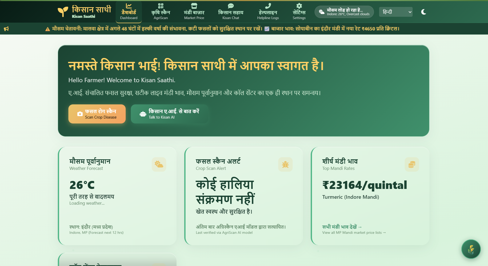
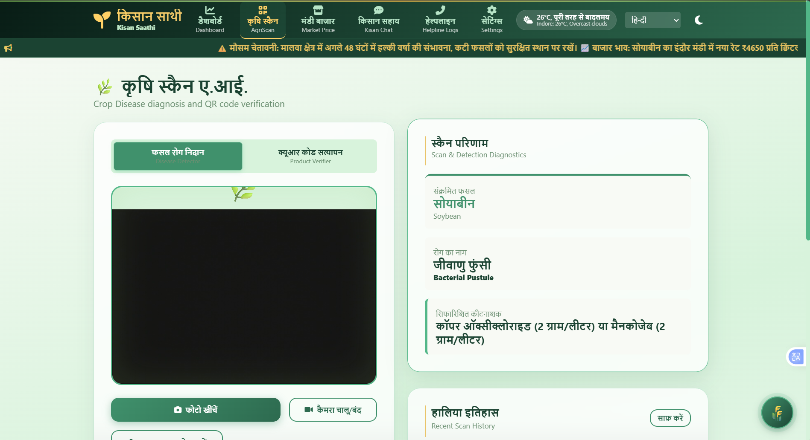
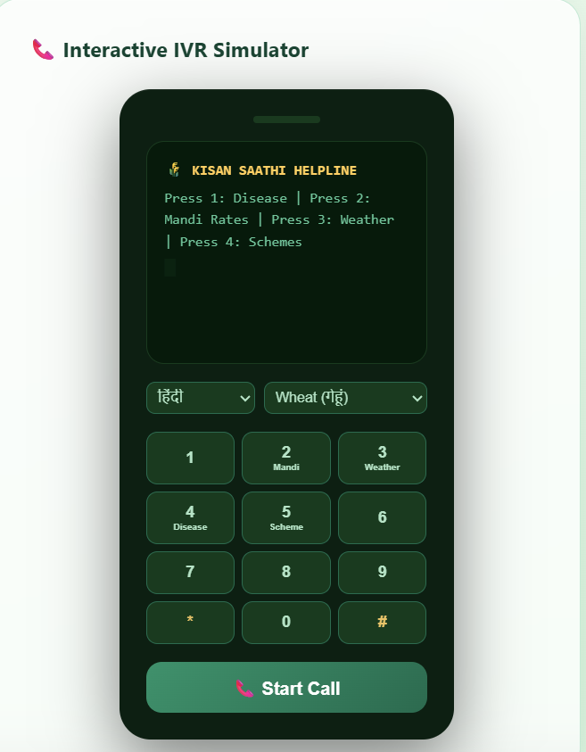
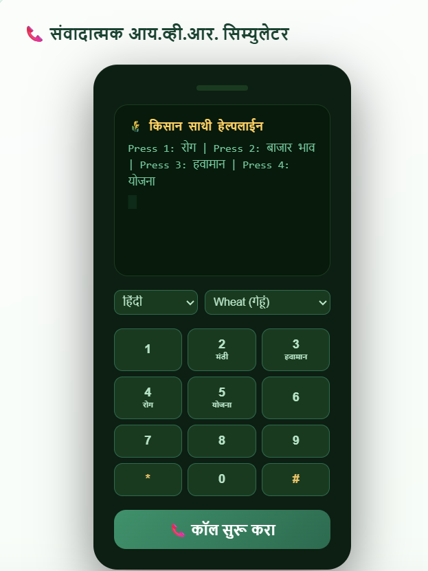
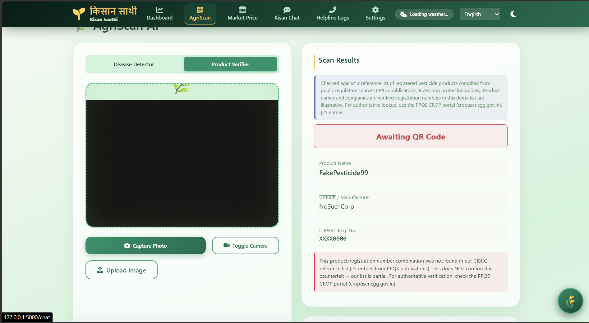

<div align="center">


# 🌱 Empowering Every Farmer with AI

<br>


<br><br>

<a href="https://kisan-saathi-backend.onrender.com/">

</a>
<a href="https://github.com/Nandinisingh07/Kisan-Saathi">

</a>

<br><br>


</div>

<div align="center">

### 🌱 ए.आई. संचालित फसल सुरक्षा, सटीक लाइव मंडी भाव, मौसम पूर्वानुमान और कॉल सेंटर का एक ही स्थान पर समन्वय। 
### 🌱AI-powered crop protection, live mandi prices, weather forecasts, and call center dashboard integration.

<br/>

</div>
Indian farmers face significant barriers to agricultural growth — language barriers across regional scripts, lack of smartphone/internet access, crop disease outbreaks, fluctuating market prices, and counterfeit pesticides. **Kisan Saathi** addresses this with a unified web dashboard for smartphone-enabled farmers and an offline voice helpline (IVR) that answers queries over a basic phone call, ensuring critical agricultural intelligence is accessible to every farmer.

**Target users/region:** Madhya Pradesh farmers, specifically the Malwa region, with full UI/chatbot translation support across 13 major Indian languages.

<div align="center">

</div>

<br/>


Runs a local **7.4 MB** `crop_disease_model.tflite` model via `ai_edge_litert.Interpreter` on the backend to classify 18 distinct plant leaf/disease states across Tomato, Potato, Bell Pepper, and Soybean crops — light enough to run on free-tier hosting.


Gemini 2.5 Flash–powered (`gemini-2.5-flash`) chatbot supporting 13 Indian languages — Hindi, English, Marathi, Gujarati, Bengali, Telugu, Tamil, Kannada, Malayalam, Punjabi, Odia, Assamese, and Urdu — with spoken replies via gTTS.


No app, no internet — a real Twilio webhook (`/voice`, `/gather`) accepts incoming calls and uses Gemini-based operator scripts to read out mandi prices, weather forecasts, and crop disease remedies in the farmer's language.


Real district-level commodity prices via Agmarknet (data.gov.in), with a local `mandi_prices.csv` fallback that simulates daily market price changes when the API is unreachable.


Live conditions and 3-day forecasts via OpenWeatherMap, translated into the farmer's language, with proactive safety alerts (e.g. advising against pesticide sprays during rainfall warnings).


Compares scanned product details (via OpenCV) against `cibrc_registered_db.py` — a local reference list of CIB&RC-registered pesticides — to verify combinations and flag unverified listings.
<br>
<br>
<div align="center">
<div align="center">

</div>
<br/>
<div align="center">


<br>


<br>


<br>


<br>


<br>

</div>

<br><br>


<div align="center">

</div>
<br/>

<div align="center">

<table>
<tr>
<td align="center" bgcolor="#166534" width="700">
<font color="#F5F5DC"><b>🌾 Flask Backend (app.py)</b><br/><sub>main router · lifecycle · DB triggers</sub></font>
</td>
</tr>
</table>

<sub>▼&nbsp;&nbsp;&nbsp;&nbsp;&nbsp;&nbsp;&nbsp;&nbsp;&nbsp;&nbsp;&nbsp;&nbsp;&nbsp;&nbsp;&nbsp;&nbsp;&nbsp;&nbsp;&nbsp;&nbsp;&nbsp;&nbsp;▼&nbsp;&nbsp;&nbsp;&nbsp;&nbsp;&nbsp;&nbsp;&nbsp;&nbsp;&nbsp;&nbsp;&nbsp;&nbsp;&nbsp;&nbsp;&nbsp;&nbsp;&nbsp;&nbsp;&nbsp;&nbsp;▼</sub>

<table>
<tr>
<td align="center" bgcolor="#9DC183" width="220" valign="top">
<b>🌐 Web Dashboard</b><br/><br/>
<sub>scan · chat · market<br/>weather · QR</sub>
</td>
<td align="center" bgcolor="#F5F5DC" width="220" valign="top">
<b>☎️ Twilio IVR Call</b><br/><br/>
<sub>/voice · /gather<br/>webhooks</sub>
</td>
<td align="center" bgcolor="#6B7280" width="220" valign="top">
<font color="#F5F5DC"><b>🧠 Gemini 2.5 Flash</b><br/><br/>
<sub>chat · translation<br/>TTS text</sub></font>
</td>
</tr>
</table>

<sub>Web Dashboard and Twilio IVR both route language/voice requests through Gemini 2.5 Flash for translation and TTS generation.</sub>

</div>

<br/>

| File | Responsibility |
|---|---|
| `app.py` | Main Flask application lifecycle, router, database triggers, and Twilio `/voice`/`/gather` webhooks |
| `chatbot_service.py` | Chatbot API endpoint, conversation history management, multi-key Gemini rate-limit rotation |
| `model_service.py` | Lazy-loaded TFLite inference pipeline for crop leaf classification |
| `weather_service.py` | Offline weather lookup & Gemini-based weather translation helper |
| `firebase_service.py` | Firestore integration and pesticide validation |
| `cibrc_registered_db.py` | Local fallback database registry for chemical/pesticide lookup |
| `data_fetcher.py` | Government dataset (Agmarknet) fetch routines |

<br><br>

<div align="center">


</div>

<br/>

```powershell
git clone https://github.com/Nandinisingh07/Kisan-Saathi.git
cd Kisan-Saathi
pip install -r requirements.txt
cp .env.example .env   # fill in the values below
python seed_firestore.py   # optional: seed Firestore product registry
python run.py          # → http://127.0.0.1:5000
```

**Environment variables required:**

| Variable | Purpose |
|---|---|
| `GEMINI_API_KEY` / `GEMINI_API_KEY_2` | Primary/secondary keys for chatbot translation, auto-rotate on rate-limit |
| `OPENWEATHER_API_KEY` | Key to fetch current forecast metrics |
| `DATAGOV_API_KEY` | Key to fetch government Agmarknet mandi prices |
| `TWILIO_ACCOUNT_SID` / `TWILIO_AUTH_TOKEN` | Credentials to trigger the Twilio IVR helpline |
| `MY_PHONE_NUMBER` | Phone number configuration for Twilio script calls |
| `FLASK_SECRET_KEY` | Security signature for sessions |

**Python version:** 3.11
<br><br>
<br>
<br>
<div align="center">

</div>
<br/>

<div align="center">

<table>
<tr>
<td align="center" width="50%">
<b>🌐 Multilingual Dashboard</b><br/><br/>

</td>
<td align="center" width="50%">
<b>🩺 Crop Disease Detection & Pesticide Recommendation</b><br/><br/>

</td>
</tr>
<tr>
<td align="center" width="50%">
<b>☎️ IVR Helpline — English</b><br/><br/>

</td>
<td align="center" width="50%">
<b>☎️ IVR Helpline — Hindi</b><br/><br/>

</td>
</tr>
<tr>
<td align="center" colspan="2">
<b>🔍 Pesticide Product Verification (CIB&RC)</b><br/><br/>

</td>
</tr>
</table>
<br>

</div>
<div align="center">


</div>

<br/>

- **Zero-internet fallbacks** — the real Twilio IVR hotline lets farmers with feature phones (no internet) access crop diagnosis and mandi data
- **Offline TFLite integration** — disease diagnosis runs on a compressed, low-memory 7.4 MB TFLite interpreter instead of a resource-heavy deep learning runtime, keeping backend deployment cheap and fast
- **True multilingual sync** — handles both static UI labels and dynamic feeds (weather descriptions, crop advisory headings, scan details) across 13 native Indian languages
- **Anti-fail key rotation** — automatically rotates Gemini keys on API errors to prevent standard rate-limit blocks

**Known limitations:**
- gTTS does not support voice synthesis for Odia (`or`) and Assamese (`as`) — chatbot defaults to visual text output for these
- Free-tier Gemini API is limited to 20 requests/minute; mitigated with dictionary caches, but not eliminated

<br><br>


<br>

<div align="center">

<div align="center">


<br><br>

<b>Pre Final-Year B.Tech Student in Artificial Intelligence & Machine Learning</b><br>
Indore Institute of Science and Technology, Indore

<br><br>

<a href="www.linkedin.com/in/nandinisingh10">

</a>

<a href="https://github.com/Nandinisingh07">

</a>

<a href="mailto:nandinii.singh07@gmail.com">

</a>

</div>
<br/><br/>


</div>
